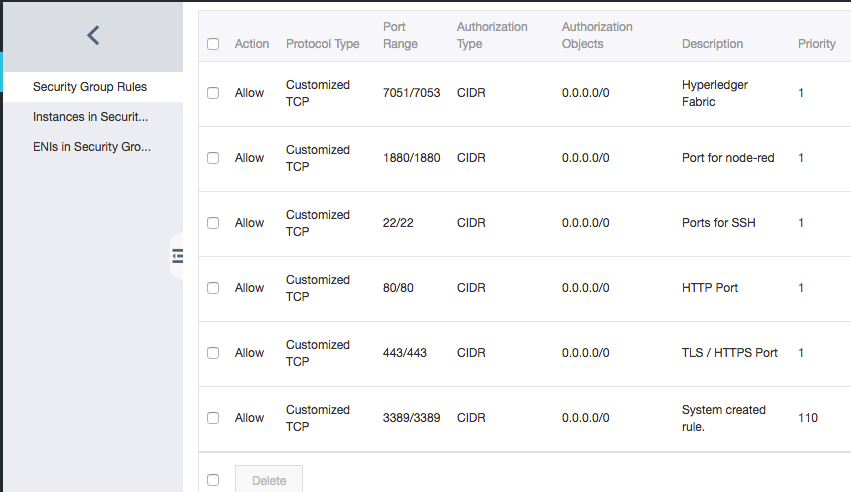
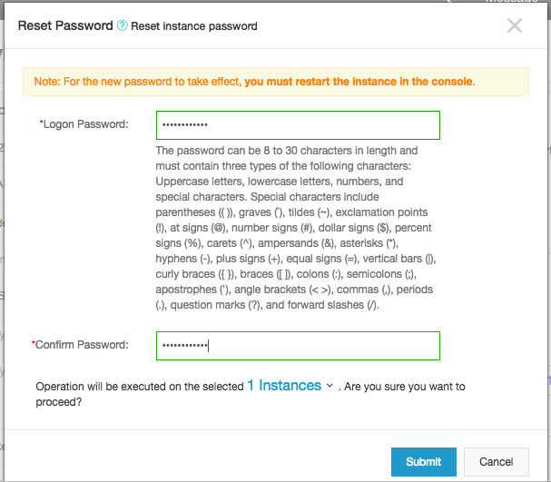
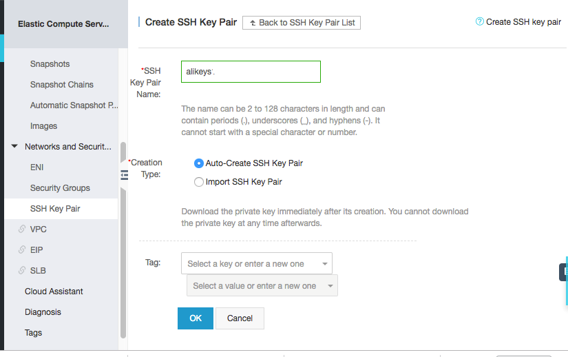
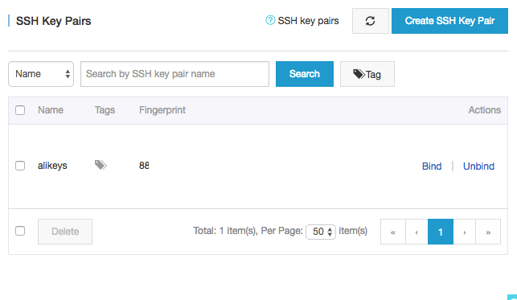
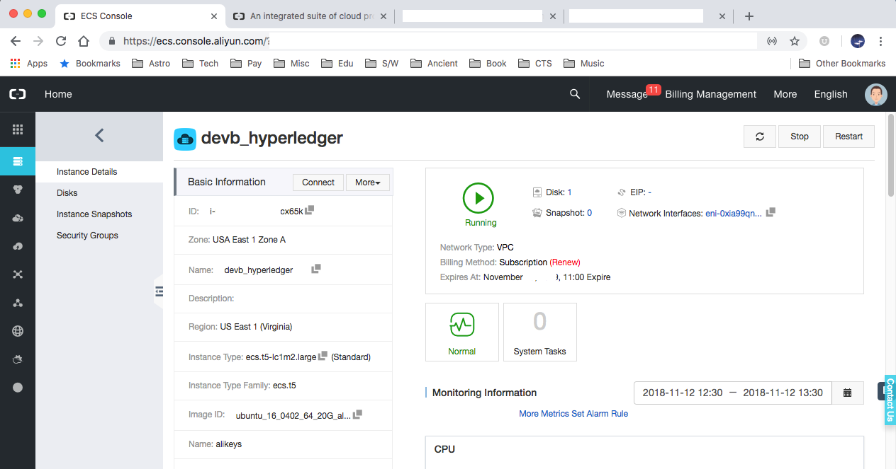
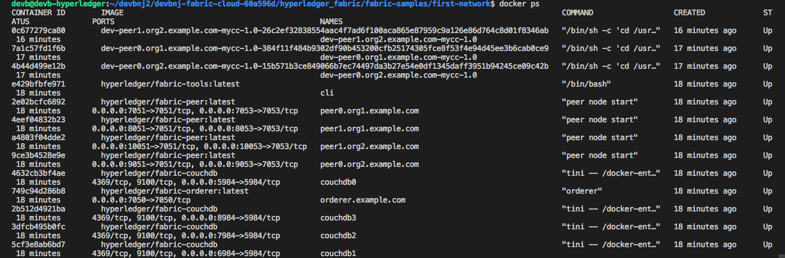
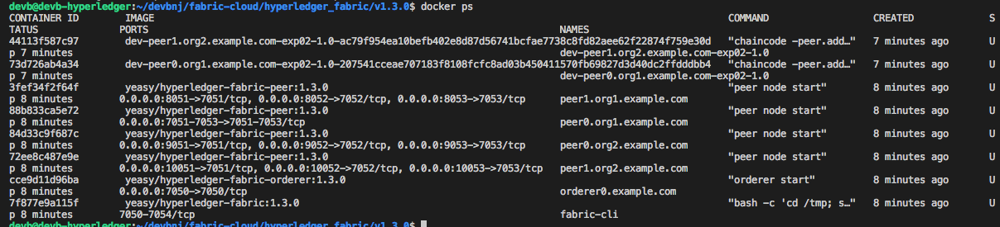
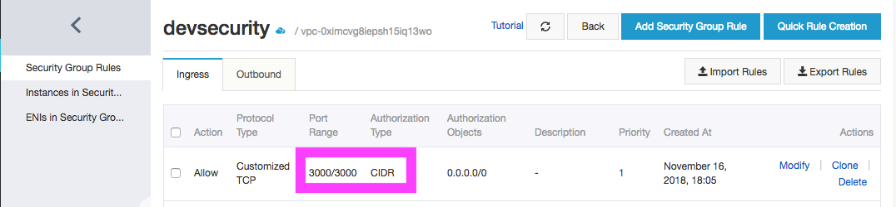
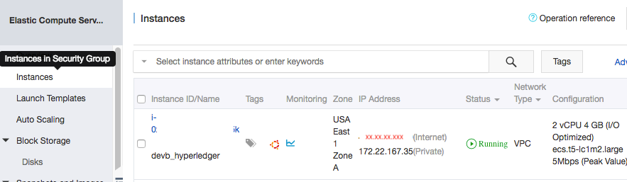
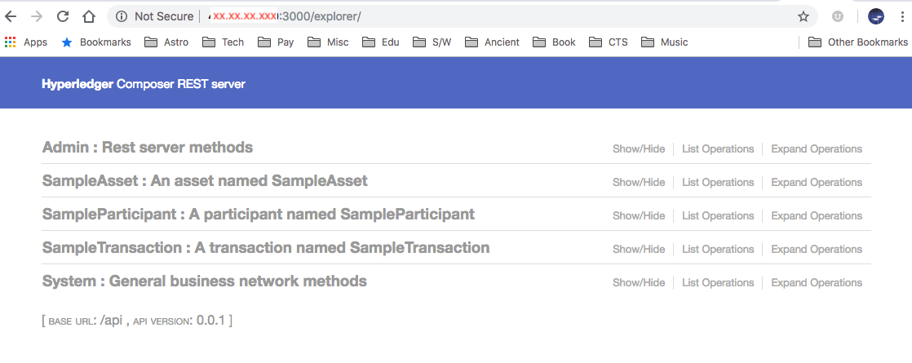

# **Running Hyperledger Fabric 1.3+ on Alibaba Cloud**


One of the big challenges a developer is likely to face with Hyperledger Fabric 1.3 or its latest version is how he can move the sandbox environment to a true production. Like most Hyperledger fans, I faced similar hassles running in a production environment. I loved that Alibaba Cloud offers a barebones Ubuntu 16.0.4 64-bit no-frills environment which I can safely assume as a production environment.

Now as I speak, AlibabaCloud EC Instance of 2 VCPU, 4 GB RAM and 40 GB diskspace comes unbridled. You have complete control over it, which is both useful, yet brings other security issues.

There are three resources you will use while interacting with a cloud instance.

1. The Instance itself – which is easier managed through the console. I will refer this to as 'console'
2. The application on the Instance – In our case it is Hyperledger Fabric – Latest version. I refer this as the 'instance' in the document.
3. The Local machine through which you access the instance. I refer this to as 'local' in the document.



**CONSOLE:** One of the first things you do is define a security group that goes with the instance. Hyperledger Fabric is a bunch of applications that comprises the Blockchain, Kafka, Zookeeper and CouchDB database. Which means clearly that we will keep certain ports open as the network scales and accommodates more peers. Defining the port ranges may result in external communication. It requires port 22 for SSH, 80 preferably is great for HTTP and 443 for HTTPS. Additionally, you may want to open ports that may require you to communicate with CouchDB or ports that Kafka and Zookeeper.



**CONSOLE:** The next thing you do is to change the password. The EC instance comes with a default password which is great as it is hard to remember and even harder to crack. But I find it easier to set the instance with a password I can remember.



**CONSOLE:** Remember to restart the server instance after making these changes.

**CONSOLE:** The next thing you do in the console is create a certificate (keys) that you can use to SSH or Telnet into the server instance. Create the SSH keys and its binding to the server. In our case, we created "alikeys.pem" for download and use in SSH.



**CONSOLE:** Once you have generated the certificates, bind these keys to the server instance. This will ensure your ability to use a local instance to log into the server with these keys. In case you have re-initialized the server, which I have done often, it will be a good idea to re-run the local instance to adapt to the new SSH server environment.

**LOCAL:** In this case, you would run:

```
$ ssh-keygen -R [xx.xx.xxx.xxx] # - your server IP address
```

**CONSOLE:** The console gives you an option in generating keys or using an existing key for different instances. The "bind" and "unbind" options allow the certificate keys to be either bound or unbound to an instance.

**LOCAL:** Download the keys to your local machine and convert the keys to read-only before using with SSH.

```
$ chmod 400 alikeys.pem
```

**CONSOLE:** Just a quick recap. So far, on your console, you reset the password. Generated the keys and bound them to the server instance. Your names and keys may follow a different nomenclature from the name shown. Allow me to put on my architecture hat on naming conventions. In the cloud, often the instances grow into a large number. Naming them properly will give you the ability to rapidly search and monitor an instance. The naming convention used here is far from it, but having cloud instances for development, staging and production gives you an idea of how you want to qualify the instance naming.



**LOCAL:** Now from your local machine, SSH into the server instance.

```
$ ssh -i ~/nodejs/alikeys.pem root@xx.xx.xxx.1xx
```
>Welcome to Ubuntu 16.04.4 LTS (GNU/Linux 4.4.0-117-generic x86_64)
>* Documentation: https://help.ubuntu.com
>* Management: https://landscape.canonical.com
>* Support: https://ubuntu.com/advantage
>Welcome to Alibaba Cloud Elastic Compute Service !


**INSTANCE:** Working as ROOT is not preferred from a security point of view either in development or production. It is time to create a new user, devb (or your user name) and assign it to the SUDO group.

```
$ adduser devb
$ usermod -aG sudo devb
$ su - devb
```
**INSTANCE:** Next, we install Fabric 1.3 prerequisites as the new user.

```
$ cd ~
$ curl -O https://hyperledger.github.io/composer/v0.19/prereqs-ubuntu.sh
$ chmod u+x prereqs-ubuntu.sh
$ ./prereqs-ubuntu.sh
```
### It will install the following

>* Node: v8.12.0
>* npm: 6.4.1
>* Docker: Docker version 18.09.0, build 4d60db4
>* Docker Compose: docker-compose version 1.13.0, build 1719ceb
>* Python: Python 2.7.12

**INSTANCE:** Check the node.js and docker version and reboot.

```
$ node -v
$ reboot
```

**LOCAL:** At the reboot, your SSH session ends. You will have to re-SSH into the server instance to continue the installation.

```
$ ssh -i ~/nodejs/alikeys.pem root@xx.xx.xxx.xxx
$ su - devb
```

**INSTANCE:** The package add-apt-repository is likely not installed on your system. But if you try to use sudo apt-get install add-apt-repository, it won't work. Install the software properties to keep going.

```
$ sudo apt-get install software-properties-common
```

**INSTANCE:** Download the Fabric 1.3 meant for the cloud that I have configured using Yeasy and Fabric-Samples from Hyperledger Fabric.
```
$ mkdir {install-dir} && cd {install-dir}
$ curl -LkSs https://api.github.com/repos/devbnj/fabric-cloud/tarball -o fabric-cloud.tar.gz
$ tar -xvf fabric-cloud.tar.gz
```

**INSTANCE:** You may need Go-lang, if you want to add Smart Contracts or ChainCode.

```
$ sudo apt-get update
$ sudo apt-get -y upgrade
$ curl -O https://storage.googleapis.com/golang/go1.11.2.linux-amd64.tar.gz
$ sudo mv go /usr/local
$ sudo nano ~/.profile
```
### Add the text to the end the .profile file
>* export GOROOT=$HOME/go
>* export GOPATH=$HOME/work
>* export PATH=$PATH:$GOROOT/bin:$GOPATH/bin
>* export FABRIC_CFG_PATH=/home/{user}/{install}/hyperledger_fabric/root/config

```
$ source ~/.profile
# -- test go
$ go version
```

**INSTANCE:** Now install Fabric 1.3 on docker containers and the samples.

```
$ curl -sSL http://bit.ly/2ysbOFE | bash -s 1.2.1
$ export PATH=/home/devb/bin:$PATH
```

**INSTANCE:** One thing you will notice in the samples is they offer examples from basic to advanced. 

Let's run the first network and more complex scenarios.
```
$ cd ~/{install directory}/hyperledger_fabric/fabric-samples/scripts
$ ./bootstrap.sh
# -- this will install the binaries and docker images
Installing Hyperledger Fabric binaries
=== Downloading: …
Installing Hyperledger Fabric docker images
=== Pulling fabric Images
…
# -- now we move to the first network
$ cd ~/{install dir}/hyperledger_fabric/fabric-samples/first-network
# -- generate the certificates and keys
$ ./byfn.sh generate
# -- start the containers for node.js and keep the local database as couch-db
$ ./byfn.sh up -l node -s couchdb
…
/home/{user}/{install}/hyperledger_fabric/fabric-samples/first-network/../bin/cryptogen
##########################################################
Generate certificates using cryptogen tool
##########################################################
++ cryptogen generate --config=./crypto-config.yaml
org1.example.com
org2.example.com
++ res=0
++ set +x
/home/{user}/{install}/hyperledger_fabric/fabric-samples/first-network/../bin/configtxgen
##########################################################
########## Generating Orderer Genesis block ##############
##########################################################
++ configtxgen -profile TwoOrgsOrdererGenesis -outputBlock ./channel-artifacts/genesis.block
…
#################################################################
Generating channel configuration transaction 'channel.tx'
#################################################################
++ configtxgen -profile TwoOrgsChannel -outputCreateChannelTx ./channel-artifacts/channel.tx -channelID mychannel
#################################################################
####### Generating anchor peer update for Org1MSP ##########
#################################################################
++ configtxgen -profile TwoOrgsChannel -outputAnchorPeersUpdate ./channel-artifacts/Org1MSPanchors.tx -channelID mychannel -asOrg Org1MSP
…
Creating network "net_byfn" with the default driver
Creating volume "…"
Creating cli ... done
START
Build your first network (BYFN) end-to-end test
Channel name : mychannel
Creating channel...
# -- have all peers join the channel created
Having all peers join the channel...
peer channel join -b mychannel.block
# -- install the Chaincode on different peers
Install chaincode on peer0.org2...
peer chaincode install -n mycc -v 1.0 -l node -p /opt/gopath/src/github.com/chaincode/chaincode_example02/node/
# -- instantiate the Chaincode

Instantiating chaincode on peer0.org2...
# -- query the Chaincode
Querying chaincode on peer0.org1...
peer chaincode query -C mychannel -n mycc -c '{"Args":["query","a"]}'
Attempting to Query peer0.org1 ...3 secs
========= All GOOD, BYFN execution completed ===========
END
```

**INSTANCE:** Let's check the state of the containers. "docker ps" will show the results. A lot of containers have been used and testes against. There are three instances of couchdb, 2 peers ad two organizations, the cli and others managed by docker.



**INSTANCE:** Let's try a few scenarios with the YEASY or Baohua Yang's configuration. He has some tests that are in the same download. The tests are similar with 2 orgs and 4 peers.

```
$ RELEASE=v1.3.0
$ cd ${RELEASE};
$ make setup download
$ make start

Start a fabric network with docker-compose-2orgs-4peers-solo.yaml...
make[1]: Entering directory '/home/{user}/{install}/fabric-cloud/hyperledger_fabric/v1.3.0'
Clean all HLF containers and chaincode images
…
May manually clean the crypto-config, solo/channel-artifacts and org3/crypto-config
make[1]: Leaving directory '/home/{user}/{install}/fabric-cloud/hyperledger_fabric/v1.3.0'
Pulling cli (yeasy/hyperledger-fabric:1.3.0)...
…
```

```
$ make test

Create channel on the fabric network
=== Creating channel businesschannel with businesschannel.tx... ===
=== Create Channel businesschannel by org 1/peer 0 ===
=== Channel businesschannel is created. ===
=== Created channel businesschannel with businesschannel.tx ===
…

Join channel
=== Join peers 0 from org 1 into businesschannel... ===
=== Join org 1/peer 0 into channel businesschannel ===
=== org 1/peer 0 joined into channel businesschannel ===
=== Join org 1/peer 1 into channel businesschannel ===
=== org 1/peer 1 joined into channel businesschannel ===
=== Join org 2/peer 0 into channel businesschannel ===
=== org 2/peer 0 joined into channel businesschannel ===
=== Join org 2/peer 1 into channel businesschannel ===
=== org 2/peer 1 joined into channel businesschannel ===
=== Join peers 0 from org 1 into businesschannel Complete ===

List the joined channels
=== Listing joined channels... ===
=== List the channels that org1/peer0 joined ===
=== Done to list the channels that org1/peer0 joined ===
=== List the channels that org1/peer1 joined ===
=== Done to list the channels that org1/peer1 joined ===
=== List the channels that org2/peer0 joined ===
=== Done to list the channels that org2/peer0 joined ===
=== List the channels that org2/peer1 joined ===
=== Done to list the channels that org2/peer1 joined ===
=== Done listing joined channels ===

Get info of the app channel
=== Getting info of channel businesschannel... ===
=== Get channel info of businesschannel with id of org1/peer0 ===
=== Done to get channel info of businesschannel with id of org1/peer0 ===
=== Get channel info of businesschannel with id of org1/peer1 ===
=== Done to get channel info of businesschannel with id of org1/peer1 ===
=== Get channel info of businesschannel with id of org2/peer0 ===
=== Done to get channel info of businesschannel with id of org2/peer0 ===
=== Get channel info of businesschannel with id of org2/peer1 ===
=== Done to get channel info of businesschannel with id of org2/peer1 ===
=== Get info of channel businesschannel Complete ===

make[2]: Leaving directory '/home/{user}/{install}/hyperledger_fabric/v1.3.0'

make update_anchors

make[2]: Entering directory '/home/{user}/{install}/hyperledger_fabric/v1.3.0'
Update anchors on the fabric network
=== Updating anchor peers to peer0 for org1... ===
=== Update config on channel businesschannel ===
=== Channel businesschannel is updated. ===
=== Updating anchor peers to peer0 for org2... ===
=== Update config on channel businesschannel ===
=== Channel businesschannel is updated. ===
=== Updated anchor peers ===

…

…
```



**INSTANCE:** The docker ps command shows the different containers managed through Docker.

```
$ make stop
# -- this will stop all the containers
```

**INSTANCE:** It's time to test the blockchain setup from a remote client.

**INSTANCE:** Let's now install Hyperledger Fabric Composer latest from the Github server. Install Hyperledger Composer CLI SDK along with it. This step may be unwanted if you plan to use Go-lang to create ChainCode and use the SDK with languages like Java, Python or NodeJS. To maintain a common language of communication, most of the commands in this article are JavaScript based. Also, after you have logged in, change over as the Sudo User when you have SSH'd into the server.

```
$ npm install -g composer-rest-server@0.20
$ npm install -g composer-cli@0.20
$ npm install -g generator-hyperledger-composer@0.20
$ npm install -g yo
$ npm install -g composer-playground@0.20
```

```
# -- this will stop all the containers
$ docker kill $(docker ps -q)
$ docker rm $(docker ps -a -q)
```

```
$ cd ~/{install}/hyperledger_fabric/fabric-dev-servers/
$ export FABRIC_VERSION=hlfv12
$ ./ startFabric.sh
```

This will start the Hyperledger Fabric 1.2 or 1.3 instance with a few peers and

```
$ ./createPeerAdminCard.sh

Development only script for Hyperledger Fabric control
Running 'createPeerAdminCard.sh'
FABRIC_VERSION is set to 'hlfv12'
FABRIC_START_TIMEOUT is unset, assuming 15 (seconds)
Using composer-cli at v0.20.4
Successfully created business network card file to
    Output file: /tmp/PeerAdmin@hlfv1.card
Command succeeded
Successfully imported business network card
    Card file: /tmp/PeerAdmin@hlfv1.card
    Card name: PeerAdmin@hlfv1
Command succeeded
Hyperledger Composer PeerAdmin card has been imported, host of fabric specified as 'localhost'
```

```
$ yo hyperledger-composer:businessnetwork
```
>* *Welcome to the business network generator*
>* ? Business network name: health-plan
>* ? Description: health plan
>* ? Author name: devb
>* ? Author email: devb@linux.com
>* ? License: Apache-2.0
>* ? Namespace: com.devb.health
>* ? Do you want to generate an empty template network? No: generate a populated sample network
>+ *create package.json*
>+ *create README.md*
>+ *create models/com.devb.health.cto*
>+ *create permissions.acl*
>+ *create .eslintrc.yml*
>+ *create features/sample.feature*
>+ *create features/support/index.js*
>+ *create test/logic.js*
>+ *create lib/logic.js*

```
$ cd health-plan
$ composer archive create -t dir -n .
```

```
$ composer network install --card PeerAdmin@hlfv1 --archiveFile health-plan@0.0.1.bna
```

```
$ composer network start --networkName health-plan --networkVersion 0.0.1 --networkAdmin admin --networkAdminEnrollSecret adminpw --card PeerAdmin@hlfv1 --file healthplan.card
```

```
$ composer card import --file healthplan.card
```

```
$ composer network ping --card admin@health-plan
```

```
$ composer-rest-server
```
>* ? Enter the name of the business network card to use: admin@health-plan
>* ? Specify if you want namespaces in the generated REST API: never use namespaces
>* ? Specify if you want to use an API key to secure the REST API: No
>* ? Specify if you want to enable authentication for the REST API using Passport: No
>* ? Specify if you want to enable the explorer test interface: Yes
>* ? Specify a key if you want to enable dynamic logging: no
>* ? Specify if you want to enable event publication over WebSockets: No
>* ? Specify if you want to enable TLS security for the REST API: No
>* To restart the REST server using the same options, issue the following command:
>*      composer-rest-server -c admin@health-plan -n never -u true -d n



**CONSOLE:** Ensure port 3000 is open in the security group that connects to this instance. It is important this issue be resolved at its inception. Port 80 and 443 may be closed, unless the Node.JS code acts simply as a delegate.



**CONSOLE:** If port 3000 is unopened, then one can add a new rule that ensures the port is open to HTTP or TCP communications. At this juncture it is also a good idea to check the IP address that is exposed to Internet, not private. Which implies, all communication to the RESTful interface that you are about to expose will be the internet address: 3000.

**LOCAL:** Open your web browser and type http://[above internet ip address]:3000 and you can view the web application that exposes the blockchain application to accept transactions, add participants and others.



This opens a new world onto the distributed systems environment. Blockchain systems such as Hyperledger Fabric are mostly machine-to-machine communication. The only intervention comes from introducing a new private network, or adding participants or adding or modifying a smart contract in other words the underlying Chaincode. The ability to interact smart with a set of peers, orderers, Chaincode and CLIs becomes the business case for the next-gen computing standards.

***
