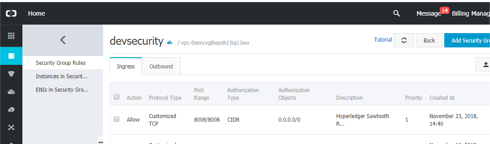
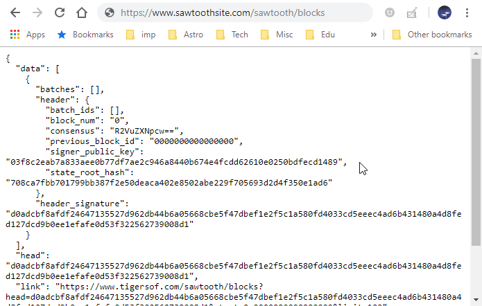

# **Installing Hyperledger Sawtooth 1.0.5 on Alibaba Cloud EC Instance**


Sawtooth is a powerful Permissioned Blockchain Network offering from Hyperledger. Sawtooth is primarily driven by Intel and notes and documentation are their contribution. Unlike its peer, Fabric, Sawtooth is a nimble system that runs on small containers. For Hyperledger Fabric 1.3, I had chosen a ECS instance from Alibaba Cloud with Ubuntu 16.0.4 64 Bit, 2 VCPU, 4 GB RAM and 40 GB disk space. I let the two block chains co-exist on the ECS instance, besides opening the two blockchain systems to the external world. 

This article is on Hyperledger Sawtooth installation and you can read about Hyperledger Fabric in a previous article. Hyperledger team has tested Sawtooth on Ubuntu 16.0.4 as we write, though there are some nightly builds that support 18.x. 

**CONSOLE:** Set up the EC Instance. In our case we had chosen a 64-bit Ubuntu 16.0.4 running on 2 VCPUs, 4 GB, 40 GB. You can select a downgraded version such as 1 VCPU, 2 GB RAM and 20 GB instance.


**CONSOLE:** Set a security group. Assign or create a new set of keys for the instance and download the keys. Ensure the keys are secure and only readable by you before using them.



**LOCAL:** Secure the downloaded keys.
```
$ chmod 400 alikeys.pem
```

**LOCAL:** SSH (Secure Shell) into your new server instance.
```
$ ssh -i ~/nodejs/alikeys.pem root@xx.xx.xxx.xxx
```
You should see a similar greeting:
```
Welcome to Ubuntu 16.04.5 LTS (GNU/Linux 4.4.0-117-generic x86_64)

 * Documentation:  https://help.ubuntu.com
 * Management:     https://landscape.canonical.com
 * Support:        https://ubuntu.com/advantage

Welcome to Alibaba Cloud Elastic Compute Service !
```

If is not a generic Ubuntu 16.0.4 64-Bit system, you may have chosen an incorrect instance. It will be a challenge in installing Sawtooth on such an instance.

**INSTANCE:** Create a new user for all related installations regarding Hyperledger Sawtooth.
```
$ adduser devb
$ usermod -aG sudo devb
$ su - devb
```

**INSTANCE:** Install Apache2 on this new server
```
# -- This will ensure your instance is upto date 
$ sudo apt update
# -- Install Apache webserver now
$ sudo apt-get install apache2
# -- Ensure SSL, headers and proxying is ready for Apache
$ a2enmod ssl
$ a2enmod headers
$ a2enmod proxy_http
```

**INSTANCE:** Upon successful installation of Apache, the install kit sets up a 'htdocs' folder where the htmls get stored.
```
# -- /var/www
```
**LOCAL:** After Apache’s installation, turn your attention to your local machine, fire up a web browser and check out the instance. The xx.xx.xxx.xxx represents the IPv4 address you can get from the Alibaba Cloud Console.
```
http://xx.xx.xxx.xxx
```

**INSTANCE:** Change the attributes and the ownership of the Web Folder.
```
# -- change the attributes of the web root folder
$ sudo chmod -R 755 /var/www
$ cd /var/www
$ sudo chown root:devb *
```

**INSTANCE:** If you are planning on pointing your domain name to this instance, this is the right time make the changes to the apache configuration file.
```
$ cd /etc/apache2/sites-available
$ nano 000-default.conf
$ systemctl restart apache2
```

**INSTANCE:** Sawtooth expects a few prerequisites installed before attempting to install and finetune itself. As you may have noticed, the ECS instance chosen is a relatively small resource intensive instance and I intend to show you what it entails to run Sawtooth without any other frills in a barebones Ubuntu 16.0.4 instance equipped with Apache.

```
# -- if you have an earlier installation or even a failed installation
$ sudo rm /var/lib/dpkg/lock
# -- on with the Sawtooth installation
$ sudo apt-key adv --keyserver hkp://keyserver.ubuntu.com:80 --recv-keys 8AA7AF1F1091A5FD
$ sudo add-apt-repository 'deb http://repo.sawtooth.me/ubuntu/1.0/stable xenial universe'
# -- ensure your instance is upto date with the suggested repository
$ sudo apt update
$ sudo apt-get install -y sawtooth
# -- clean up
$ sudo apt autoremove
```

**INSTANCE:** Its a good idea to take an inventory of what all you installed with Sawtooth.
```
$ sudo apt search sawtooth
```

For Sawtooth to perform Blockchain operations, it needs Transaction Processors, Consesus mechanism, Sawtooth CLI, REST API, SDK, Validator and some examples.
```
# -- response 
Sorting... Done
Full Text Search... Done
...
python3-sawtooth-block-info/xenial 1.0.5-1 all
  Sawtooth Block Info Transaction Processor
python3-sawtooth-cli/xenial,now 1.0.5-1 all [installed,automatic]
  Sawtooth CLI
python3-sawtooth-ias-client/xenial 1.0.5-1 all
  Sawtooth Intel Attestation Service Client
python3-sawtooth-ias-proxy/xenial 1.0.5-1 all
  Sawtooth Intel Attestation Service Proxy
python3-sawtooth-identity/xenial 1.0.5-1 all
  Sawtooth Identity Transaction Processor
python3-sawtooth-intkey/xenial,now 1.0.5-1 all [installed,automatic]
  Sawtooth Intkey Python Example
python3-sawtooth-manage/xenial 0.8.8-1 all
  Sawtooth Lake Management Library
python3-sawtooth-poet-cli/xenial,now 1.0.5-1 all [installed,automatic]
  Sawtooth PoET CLI
python3-sawtooth-poet-common/xenial,now 1.0.5-1 all [installed,automatic]
  Sawtooth PoET Common Modules
python3-sawtooth-poet-core/xenial,now 1.0.5-1 all [installed,automatic]
  Sawtooth Core Consensus Module
python3-sawtooth-poet-families/xenial,now 1.0.5-1 all [installed,automatic]
  Sawtooth Transaction Processor Families
python3-sawtooth-poet-sgx/xenial 1.0.5-1 amd64
  Sawtooth PoET SGX Enclave
python3-sawtooth-poet-simulator/xenial,now 1.0.5-1 all [installed,automatic]
  Sawtooth PoET Simulator Enclave
python3-sawtooth-rest-api/xenial,now 1.0.5-1 all [installed,automatic]
  Sawtooth REST API
python3-sawtooth-sdk/xenial,now 1.0.5-1 all [installed,automatic]
  Sawtooth Python SDK
python3-sawtooth-settings/xenial,now 1.0.5-1 all [installed,automatic]
  Sawtooth Settings Transaction Processor
python3-sawtooth-signing/xenial,now 1.0.5-1 all [installed,automatic]
  Sawtooth Signing Library
python3-sawtooth-validator/xenial,now 1.0.5-1 all [installed,automatic]
  Sawtooth Validator
python3-sawtooth-xo/xenial,now 1.0.5-1 all [installed,automatic]
  Sawtooth XO Example
sawtooth/xenial,now 1.0.5 all [installed]
  Hyperledger Sawtooth Distributed Ledger
sawtooth-intkey-tp-go/xenial 1.0.5 all
  Sawtooth Intkey TP Go
sawtooth-noop-tp-go/xenial 1.0.5 all
  Sawtooth Noop TP Go
sawtooth-sabre/xenial 0.1.2 amd64
  Sawtooth Sabre Transaction Processor
sawtooth-smallbank-tp-go/xenial 1.0.5 all
  Sawtooth Smallbank TP Go
sawtooth-xo-tp-go/xenial 1.0.5 all
  Sawtooth Go XO TP
…
```

**INSTANCE:** You will find the steps in the Sawtooth Documentation. Some of them are repeated here. The next steps generate the public and private keys for the Validator. The Validator recognizes those Transactors who present their transactions authenticated by the public key.
```
$ sawtooth keygen
# -- response
# -- creating key directory: /home/devb/.sawtooth/keys
# -- private key
# -- writing file: /home/devb/.sawtooth/keys/devb.priv
# -- public certificate
# -- writing file: /home/devb/.sawtooth/keys/devb.pub
```

**INSTANCE:** Now you generate the genesis batch file for the Validator.
```
$ sudo sawset genesis --key ~/.sawtooth/keys/devb.priv
# -- response
# -- Generated config-genesis.batch
```

**INSTANCE:** Generate the keys for the Validator.
```
$ sudo sawadm keygen
# -- response
# -- writing file: /etc/sawtooth/keys/validator.priv
# -- writing file: /etc/sawtooth/keys/validator.pub
```

**INSTANCE:** Configuring Sawtooth - If the config directory has a file named validator.toml, the configuration settings are applied when the validator starts.

* By default, the config directory is /etc/sawtooth/
* Sawtooth installation adds a few example files in that folder
* Its a good start to view the folder and rename or copy the files as extension TOML.
* TOML files are the same as YAML files. Toml convention used is similar to YAML files. Edit the toml files as necessary.

```
$ cd /etc/sawtooth
$ sudo cp cli.toml.example cli.toml
$ sudo cp path.toml.example path.toml
$ sudo cp rest_api.toml.example rest_api.toml
$ sudo cp log_config.toml.example log_config.toml
$ sudo cp settings.toml.example settings.toml
$ sudo cp validator.toml.example validator.toml
$ sudo cp xo.toml.example xo.toml
```
**INSTANCE:** Stop the services that may have auto started after the installation. Sawtooth generates many Sytemd files as part of the installatio.
```
$ sudo systemctl stop sawtooth-validator.service
$ sudo systemctl stop sawtooth-rest-api.service
$ sudo systemctl stop sawtooth-settings-tp.service
$ sudo systemctl stop sawtooth-poet-validator-registry-tp.service
```

**INSTANCE:** As part of cleanup, sometimes it is safer to the reboot the instance
```
$ exit
$ reboot
```

**LOCAL:** Back to the local machine where you will need to Secure Shell back into the instance.
```
$ ssh -i ~/nodejs/alikeys.pem root@xx.xx.xxx.xxx

```

**INSTANCE:**
```
$ su – devb
# - change the owner of this folder to the user
$ cd /etc/sawtooth
$ sudo chown devb:devb ./
$ sudo chown devb:devb *
$ sudo chown devb:devb .
```

**INSTANCE:** Start the Sawtooth Validator and RESTful services
```
$ sudo sawtooth-validator -v --endpoint localhost:8800
$ sawtooth-rest-api -v
```

**INSTANCE:** Test the service if its up and running
```
$ curl http://localhost:8008/blocks
```
**INSTANCE:** Check if Validator is using ports 8800 for other peers and 4004 for the transaction processor. The RESTful service should be listening at 8008.
```
$ netstat -a
# -- Response
Active Internet connections (servers and established)
Proto Recv-Q Send-Q Local Address           Foreign Address         State
tcp        0      0 *:ssh                   *:*                     LISTEN
tcp        0      0 localhost:8800          *:*                     LISTEN
tcp        0      0 localhost:4004          *:*                     LISTEN
tcp        0      0 localhost:8008          *:*                     LISTEN
```

**INSTANCE:** Continuing with our Apache installation, I am going to suggest using the LetsEncrypt service to secure the web application.
#### Install LetsEncrypt certificates
```
# --- install lets encrypt
$ sudo apt-get update
$ sudo apt-get autoclean
# --- ./certbot-auto
$ sudo apt-get install letsencrypt

$ sudo add-apt-repository ppa:certbot/certbot
$ sudo apt-get update
$ sudo apt-get install certbot

# --- Now get the certificates
$ sudo certbot certonly --webroot -w /var/www/html -d www.sawtoothsite.com
# --- certificates stored at
# -- /etc/letsencrypt/live/www.sawtoothsite.com/fullchain.pem
# -- /etc/letsencrypt/live/www.sawtoothsite.com/privkey.pem
```

#### Edit the apache configuration file.
```
$ sudo nano /etc/apache2/sites-enabled/000-default.conf
```

```
<VirtualHost *:80>
    ServerName www.sawtoothsite.com
    ServerAlias sawtoothsite.com www.sawtoothsite.com
    ServerAdmin devb@sawtoothsite.com
    DocumentRoot /var/www/html
</VirtualHost>

ServerName localhost

<IfModule mod_ssl.c>
<VirtualHost *:443>
    ServerName sawtoothsite.com
    ServerAlias sawtoothsite.com *.sawtoothsite.com
    ServerAdmin sawtooth@sawtooth
    DocumentRoot /var/www/html

    RequestHeader set X-Forwarded-Proto "https"

    Include /etc/letsencrypt/options-ssl-apache.conf
    SSLCertificateFile /etc/letsencrypt/live/www.sawtoothsite.com/fullchain.pem
    SSLCertificateKeyFile /etc/letsencrypt/live/www.sawtoothsite.com/privkey.pem
</VirtualHost>
</IfModule>
ProxyPass /sawtooth http://localhost:8008
ProxyPassReverse /sawtooth http://localhost:8008
RequestHeader set X-Forwarded-Path "/sawtooth"

```

#### Now set the Apache with the new sertificates 
#### Restart Apache
```
$ sudo certbot --apache -d sawtoothsite.com -d www.sawtoothsite.com
$ sudo apachectl restart
```

**LOCAL:** Check the URL on your local web browser to see if Sawtooth is accessible.
```
https://www.sawtoothsite.com/sawtooth/blocks
```


## Troubleshooting
If the validator and REST-API do not show up, it maybe necessary to bring down the services, regenerate the keys and rerun the services.
```
$ sudo systemctl stop sawtooth-settings-tp
$ sudo systemctl enable sawtooth-settings-tp
$ sudo systemctl stop sawtooth-poet-validator-registry-tp
$ sudo systemctl enable sawtooth-poet-validator-registry-tp
$ sudo systemctl stop sawtooth-validator
$ sudo systemctl enable sawtooth-validator
$ sudo systemctl stop sawtooth-rest-api.service
$ sudo systemctl enable sawtooth-rest-api.service

$ sudo sawadm keygen --force
$ sudo sawadm genesis
$ sudo sawtooth-validator -v --endpoint localhost:8800
$ sawtooth-rest-api -v
```
## Conclusion
Besides installing Hyperledger Sawtooth, this article also walks you through the steps needed to setup Apache and TLS / SSL certificates so you can access the site safely. Sawtooth as such is intended to run behind Apache and does not expose to the external world. Through the reverse proxy you can set the communications to the Sawtooth REST service.
